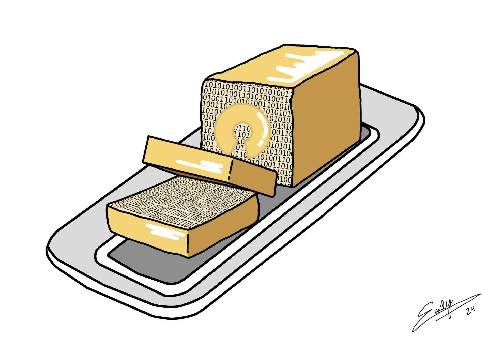

# BREAD-Local-Software (Butter)

## How to install and use:
1. Load files from the "Website Code on SD Card" folder onto the SD card and mount the card on the ESP32
2. Upload the code in the .ino file in the "Arduino Code" folder to the ESP32
4. Once uploaded, connect to the newly created Wi-Fi access point "BREAD-DARPA" with the password "12345678"
5. Open the Arduino IDE serial monitor and copy the IP address
6. Paste the IP address into a web browser like Google Chrome

## Things to change/add in the future:
1. Use JSON objects to send and receive data to and from the ESP32
2. Better CSS styling (To make it look pretty)
